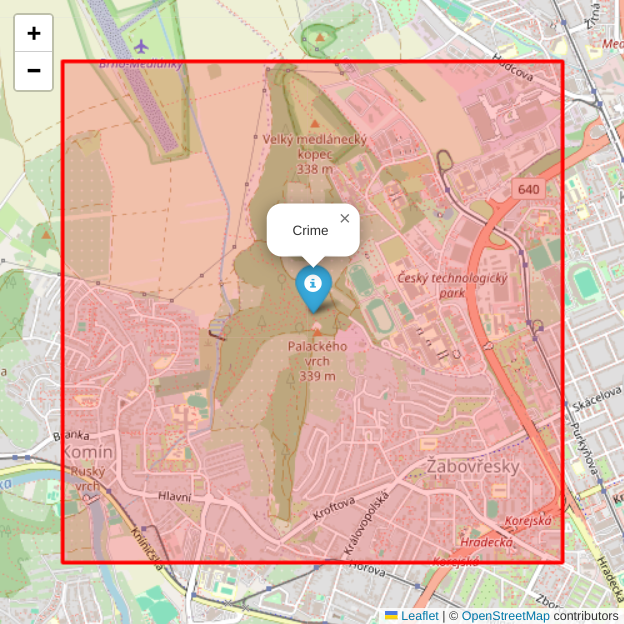
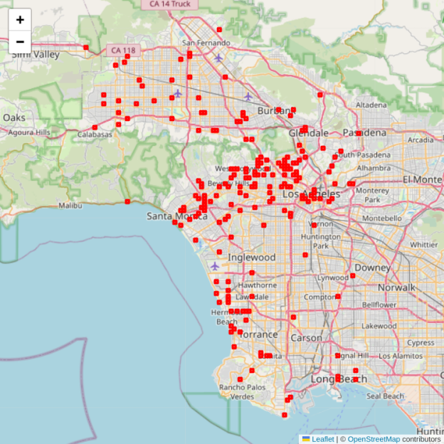
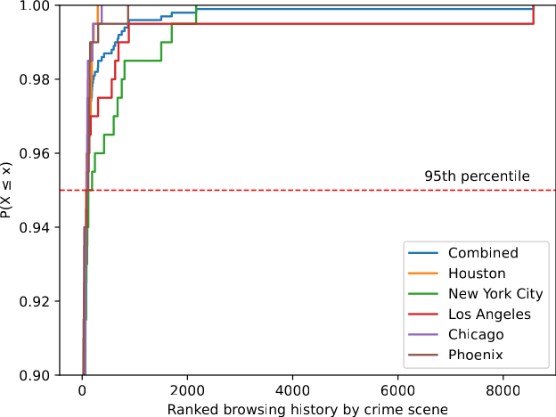
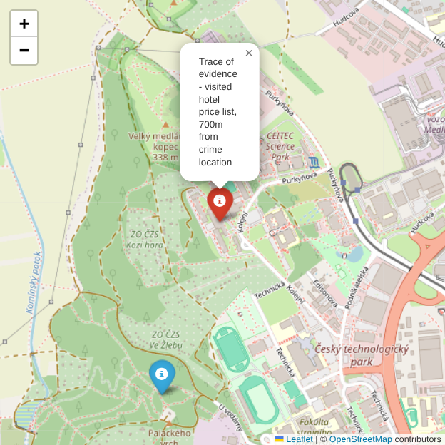

# Forensic Analysis based on Massive Mapping Data for Location Evidence from Browsing History

This forensic method helps confirm or disprove a suspect's whereabouts during the crime timeframe

The method is described in the research article *(link to be added upon publication)*

Sample investigation area around crime location to identify evidence in suspect's browsing history


 
# Content

Source code

- [forensic-web-crime-scene](forensic-web-crime-scene.ipynb)

Datasets

- [dataset-crime-scene](dataset-crime-scene) - Dataset of simulated crime scenes in New York, Chicago, Houston, Los Angeles, and Phoenix
- [dataset-forensic-web](dataset-forensic-web) - Dataset of synthetic browsing URLs

Figures

- [result-forensic-maps](result-forensic-maps) - Interactive maps of simulated crime scenes in the cities

Sample simulated crime scenes in Los Angeles



Sample performance result



# Instructions

1. Install requirements

```python
!pip install -r requirements.txt
```
2. Run the code in the Jupyter notebook [forensic-web-crime-scene](forensic-web-crime-scene.ipynb)

# Demonstration

Example of a crime location and digital trace found in browsing history



blue marker - crime location; red marker - digital trace in the suspect’s browsing history

The analysis reveals that the suspect accessed a price list from a hotel located 700m from the crime scene

The hotel records confirm their stay during the crime timeframe, and CCTV footage documents their departure prior to the incident
