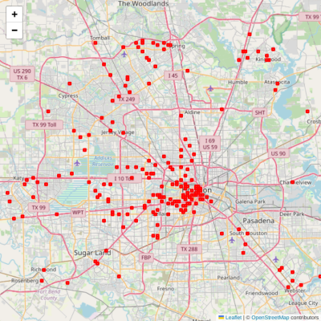
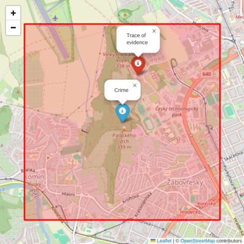

# Forensic Method for Finding Traces of Evidence in Personal Web Data by Crime Scene

Verification crime scenes in Houston, US



# Instructions

Run this code to reproduce the published results

1. Install requirements

```python
!pip install -r requirements.txt
```
2. Run Jupyter notebook [forensic-web-crime-scene](forensic-web-crime-scene.ipynb) 

# Content

Source code

- [forensic-web-crime-scene](forensic-web-crime-scene.ipynb) - Source code with the results printed

Datasets

- [dataset-crime-scene](dataset-crime-scene) - Dataset of set up verification crime scenes in New York, Chicago, Houston, Los Angeles, Phoenix
- [dataset-forensic-web](dataset-forensic-web) - Dataset of synthetic forensic web data

Figures

- [result-forensic-maps](result-forensic-maps) - Interactive maps of set up verification  crime scenes

# Use case

A forensic use case of the method application is elaborated in the manuscript



Blue marker - crime scene

Red marker - collected trace of evidence near crime scene

# Acknowledgements 
- Mapping data and geocoding from [OpenStreetMap](https://openstreetmap.org/copyright) 
- Webpages from [Common Crawl Foundation](https://commoncrawl.org/terms-of-use)
